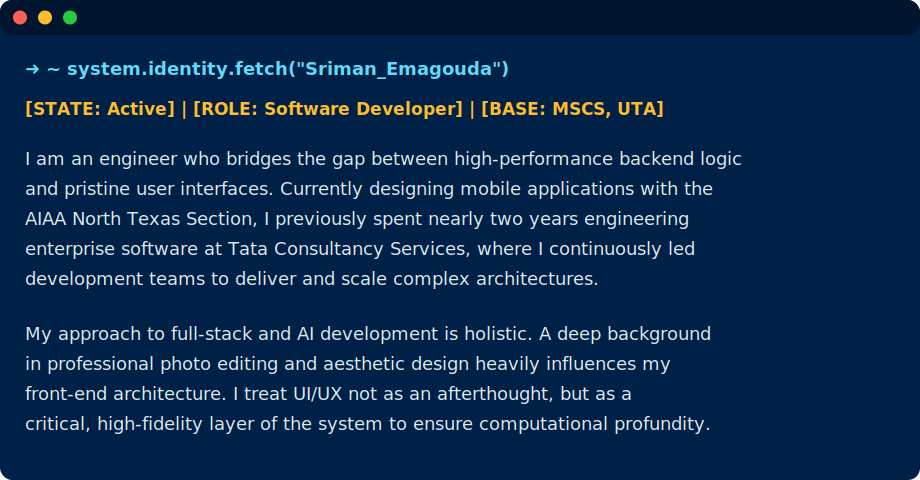

  

---

  

  

---

  

---

### ⚙️ Core Architecture & Technologies

#### **AI & Machine Learning:** 

  
  
  
  

#### **Full-Stack Ecosystem:** 

  
  
  
  
  

---

### 🏆 Milestones & Recognition
- **MS in Computer Science** | *University of Texas at Arlington (Dec 2025).*
- **Student Employee of the Year** | *Recognized for outstanding Administrative Service.*
- **2nd Place Symposium (2020)** | *Awarded for technical presentation and innovation.*

---

### ⚙️ System Architecture

  
  
<strong> Frontend & Mobile </strong>

  
    
  
  
<strong> Backend Core </strong>

  
    
  
  
<strong> Data & Storage </strong>

  
    
  
  
<strong> Cloud, Ops & Testing </strong>

  
    
 

