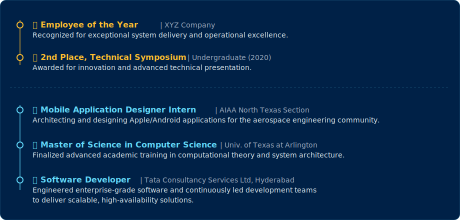

  

---

  

  

---

 

  

---

 

  

 

  
<b>Cognitive Engine (AI & Machine Learning)</b>

  
  
  
  

 

  
<b>Logic & Routing (Backend Ecosystem)</b>

  
  
  
  

 

  
<b>Interface & Interaction (Frontend & Mobile)</b>

  
  
  

 

  
<b>Persistence & Deployment (Data & Cloud)</b>

  
  
  
  

 

---

  

 

  

 

---

### ⚙️ System Architecture

  
  
<strong> Frontend & Mobile </strong>

  
    
  
  
<strong> Backend Core </strong>

  
    
  
  
<strong> Data & Storage </strong>

  
    
  
  
<strong> Cloud, Ops & Testing </strong>

  
    
 

